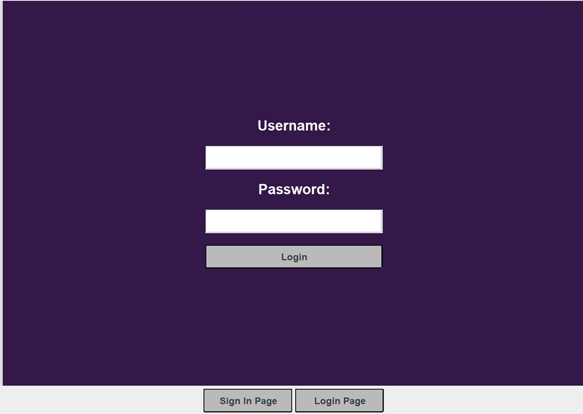

# Dokumentacja Mathero

## Wstęp  
Mathero jest innowacyjnym narzędziem do rozwiązywania zadań
matematycznych, stworzonym w języku Java, aby zapewnić użytkownikom
interaktywną i efektywną platformę edukacyjną. Ten program oferuje
szeroki zakres funkcji, umożliwiając użytkownikom generowanie zadań,
autoryzację, oraz interaktywne rozwiązywanie równań matematycznych.
Korzystając z zalet najnowszych technologii, Mathero stawia na wygodę
użytkownika i jakość interakcji, zapewniając jednocześnie solidną
podstawę matematyczną.

## Funkcjonalność programu

### Interfejs graficzny

Projekt Mathero wykorzystuje bibliotekę Java Swing do tworzenia
interfejsu użytkownika. Główne elementy interfejsu obejmują:

1. Strona rejestracji:

- Umożliwia użytkownikowi stworzenie nowego konta

- Wymaga wprowadzenia danych takich jak nazwa użytkownika, hasło, email

- Przyciski: "Sing In".

- Wyświetla ewentualne błędy w podanym haśle.

2. Strona logowania:

- Umożliwia użytkownikowi wprowadzenie nazwy użytkownika i hasła.

- Zawiera przycisk: "Login".

2. Główne okno aplikacji:

- Menu: Z opcjami takimi jak.

- Panel do generowania równań matematycznych.

- Wyświetlacz wyników.

- **CardLayout**: Umożliwia łatwe przełączanie między różnymi widokami w
  ramach jednego kontenera.

### 

###  Generowanie zadań

Ten moduł generuje zestawy zadań matematycznych o różnych rodzajach
działań arytmetycznych. Wykorzystuje klasę Generator, która losowo
tworzy zestawy zadań z uwzględnieniem różnych operacji matematycznych.

#### Kluczowe funkcje:

Generowanie losowego rodzaju działania matematycznego (dodawanie,
odejmowanie, mnożenie, dzielenie).

Tworzenie zadań z dwoma losowo wygenerowanymi liczbami i poprawnym
wynikiem operacji.

Dzięki temu modułowi możliwe jest szybkie generowanie zróżnicowanych
zadań matematycznych, co może być wykorzystane np. w celach
edukacyjnych.

### Autoryzacja

#### Opcja Rejestracji:
Aplikacja umożliwia użytkownikom utworzenie konta poprzez wprowadzenie adresu e-mail, nicku oraz hasła.

#### Opcja Logowania:
Po rejestracji użytkownicy mogą zalogować się do aplikacji, korzystając z podanego adresu e-mail i hasła.

#### Walidacja haseł:

Podczas rejestracji aplikacja sprawdza poprawność hasła - czy zawiera
odpowiednią liczbę wielkich liter, cyfr oraz znaków specjalnych.

## Użycie programu

Przed próbą uruchomienia programu upewnij się, że posiadasz
zainstalowaną Jave na swoim urządzeniu, Po pobraniu pliku zip
zawierający skompresowany należy go wypakować.  
Następnie najlepiej otworzyć konsole cmd w trybie administratora\>  
Potem używając komendy cd ***\<ścieżka/katalog\>*** przechodzimy przez
kolejne katalogi folderu aż dojdziemy do katalogu target.  
Możesz użyć tej komendy:  

***cd \<miejsceZapisuPliku\>\Zesp1-Matematyka\target***

Pamiętaj by zamienić\<miejsceZapisuPliku\>. Teraz możesz użyć komendy:  

***java -jar MatHeroApp-1.0-SNAPSHOT-jar-with-dependencies.jar***

W tym momencie aplikacja się uruchamia i możesz rozpocząć użytkowanie z
niej.

## Instrukcja obsługi

Aby zacząć korzystać z aplikacji wpierw trzeba utworzyć konto. Należy
kliknąć przycisk “Sign In Page”, wpisać odpowiednie dane i kliknąć “Sign
in”. Następnie należy zalogować się do aplikacji poprzez wciśnięcie
przycisku “Login Page”, wpisania danych do wcześniej utworzonego konta i
kliknięcie przycisku “Login”. W tym momencie powinien pojawić się ekran
z zadaniami. Na środku wyświetla się zadanie z luką do uzupełnienia. Aby
rozwiązać zadanie należy uzupełnić lukę i kliknąć “Check”. Odpowiednimi
przyciskami ze strzałkami możemy cofać i przewijać zadania. Oprócz tego
u góry ekranu widzimy licznik poprawnych odpowiedzi z rzędu.

## Moduły

### **Moduł Graficzny**

Moduł graficzny w repozytorium Mathero jest odpowiedzialny za
zarządzanie i wyświetlanie interfejsu graficznego użytkownika (GUI).
Wykorzystuje bibliotekę Java Swing do tworzenia intuicyjnego i
funkcjonalnego interfejsu, który umożliwia użytkownikom łatwą interakcję
z aplikacją.

##### **Funkcje:**

1.  **Wyświetlanie ekranu autoryzacji**:

   - Metoda displayAuthentication ustawia dwa główne panele: loginPanel
     oraz signInPanel, które przechowują odpowiednio ekrany logowania i
     rejestracji. Panel

- **Tworzenie panelu logowania**:

   - Metoda createLoginPanel tworzy panel logowania, który zawiera pola
     do wprowadzania nazwy użytkownika i hasła oraz przycisk logowania.

   - Przyciski i etykiety są stylizowane i umieszczane za pomocą
     GridBagLayout.

2.  **Tworzenie panelu rejestracji**:

   - Metoda createSignInPanel tworzy panel rejestracji, który zawiera
     pola do wprowadzania nazwy użytkownika, e-maila i hasła oraz
     przycisk rejestracji.

   - Elementy są stylizowane i rozmieszczane za pomocą GridBagLayout.

3.  **Obsługa logowania**:

   - Metoda handleLogin jest odpowiedzialna za proces logowania.
     Sprawdza poprawność wprowadzonych danych i wyświetla odpowiednie
     komunikaty użytkownikowi.

4.  **Obsługa rejestracji**:

   - Metoda handleSignIn obsługuje proces rejestracji nowego
     użytkownika. Waliduje hasło i zapisuje nowego użytkownika w
     systemie.

##### **Technologie:**

- **Java Swing**: Główna biblioteka GUI używana do tworzenia komponentów
  interfejsu użytkownika.

- **CardLayout**: Umożliwia łatwe przełączanie między różnymi widokami w
  ramach jednego kontenera.

#### **Klasa TaskDisplay**

Klasa TaskDisplay jest odpowiedzialna za wyświetlanie i zarządzanie
ekranem zadań matematycznych.

### **Funkcje:**

**Ustawienie treści zadania**:

   - Metoda setTaskContent ustawia komponenty GUI dla panelu zadań,
     takie jak pola do wprowadzania odpowiedzi, przyciski nawigacyjne
     oraz etykiety wyświetlające treść zadania.

**Nowe zadanie**:

   - Metoda newExercise generuje nowe zadanie matematyczne i
     aktualizuje interfejs o nowe dane.

**Poprzednie zadanie**:

   - Metoda previousExercise wyświetla poprzednie zadanie z zapisanych
     zadań.

**Sprawdzanie odpowiedzi**:

   - Przycisk "Check" sprawdza poprawność odpowiedzi wprowadzonej przez
     użytkownika i wyświetla odpowiednie komunikaty.

##### **Technologie:**

- **Java Swing**: Używana do tworzenia i zarządzania komponentami
  interfejsu użytkownika.

- **GridBagLayout**: Używany do precyzyjnego rozmieszczania komponentów
  na panelu.

### Moduł Generator zadań

Moduł Generatora Zadań służy do tworzenia zadań matematycznych o różnych
rodzajach działań arytmetycznych. Wykorzystuje on klasę Generator, która
generuje zestawy zadań według określonych parametrów.

Funkcje modułu:

Generowanie działania: Metoda generuj_dzialanie() generuje losowy rodzaj
działania matematycznego, zwracając wartość od 0 do 3, gdzie:

- 0 reprezentuje dodawanie,

- 1 reprezentuje odejmowanie,

- 2 reprezentuje mnożenie,

- 3 reprezentuje dzielenie.

Generowanie zadania: Metoda generuj_zadanie(int dzialanie) tworzy
zadanie matematyczne na podstawie wybranego rodzaju działania. Zadanie
składa się z dwóch losowo wygenerowanych liczb oraz wyniku operacji.
Format odpowiedzi to {liczba1, operacja, X, =, liczba2}, gdzie liczba1 i
liczba2 to liczby użyte w operacji, operacja to symbol matematyczny (np.
+, -, \*), X to wynik pośredni (np. różnica lub iloczyn), a liczba2 to
wynik końcowy.

Wykorzystane Technologie:

- Random Class: Wykorzystano klasę Random do generowania losowych liczb.

- ArrayList: Do przechowywania treści zadań wykorzystano klasę
  ArrayList.

- JUnit: Wersja 4.12, framework do testów jednostkowy

### Moduł Autoryzacji

W module autoryzacji zastosowano bezpieczny mechanizm haszowania haseł
przy użyciu algorytmu bcrypt. Dane użytkowników są przechowywane w bazie
danych JDBC, która z kolei przechowuje dane o bazie danych w folderze
DataBaseFile.

Funkcje modułu:

- Haszowanie haseł: Mechanizm autoryzacji wykorzystuje algorytm bcrypt
  do bezpiecznego haszowania haseł użytkowników przed zapisaniem ich w
  bazie danych.

- Baza danych: Dane użytkowników są przechowywane w bazie danych
  obsługiwanej przez JDBC. Informacje o bazie danych są przechowywane w
  folderze DataBaseFile.

- Klasa użytkownika: W celu obsługi autoryzacji utworzono klasę User,
  która zawiera metody służące do zarządzania danymi użytkowników.

Warstwa usług i repozytorium: Aby umożliwić łatwą obsługę danych
użytkowników, stworzono odpowiednią warstwę usług oraz repozytorium.
Warstwa usług zawiera logikę biznesową związaną z użytkownikami,
natomiast repozytorium odpowiada za kontakt z bazą danych.

Wykorzystane Technologie:

- BCrypt (jbcrypt): Użyto wersji 0.4 do bezpiecznego haszowania haseł.

- Hibernate Core: Wersja 6.4.4.Final, do obsługi bazy danych.

- H2 Database: Wersja 2.2.224, lekka baza danych Java, wykorzystywana do
  testów.

- Jakarta Validation API: Wersja 3.0.0, do walidacji danych.

- JUnit Jupiter: Wersja 5.9.2, framework do testów jednostkowych.

- JUnit: Wersja 4.12, wspiera testy jednostkowe.

### Moduł Walidacji Haseł:

Moduł walidacji haseł sprawdza poprawność wprowadzonego przez
użytkownika hasła - czy zawiera odpowiednią liczbę wielkich liter, cyfr
oraz znaków specjalnych.

Pożądana liczba elementów w haśle jest podawana jako konstruktor klasy,
lub w przypadku pustego konstruktora tworzony jest obiekt z domyślnymi
parametrami.

Metody klasy:

- isValidS() –metoda sprawdza hasło. Zwraca zmienną String, która
  zawiera opis nieprawidłowości znalezionych w haśle. Opis jest
  wyświetlany przez GUI, gdy użytkownik wprowadzi niezgodne z
  wymaganiami hasło.

- IsValidB() - wykorzystuje metodę isValidS(), zwraca true jeżeli ta nie
  znajdzie nieprawidłowości; false, jeżeli jakieś odnajdzie.

## 

## Podsumowanie

Mathero to kompleksowe narzędzie do nauki matematyki, które wyróżnia
się, intuicyjnym interfejsem użytkownika oraz solidną implementacją
modułów. Dzięki Mathero użytkownicy mogą łatwo tworzyć, rozwiązywać i
przechodzić przez różnorodne zadania matematyczne, jednocześnie
korzystając z bezpiecznej autoryzacji. Jego elastyczność i dostępność
sprawiają, że jest idealnym rozwiązaniem zarówno dla edukacji, jak i dla
indywidualnego rozwoju matematycznego.
